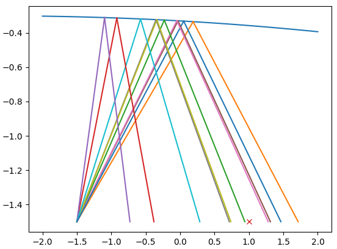
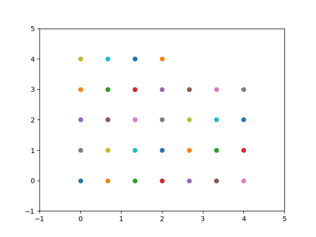

# `xitorch`: differentiable scientific computing library


[](https://xitorch.readthedocs.io/)
[](https://codecov.io/gh/xitorch/xitorch)

`xitorch` is a PyTorch-based library of differentiable functions and functionals that
can be widely used in scientific computing applications as well as deep learning.

The documentation can be found at: https://xitorch.readthedocs.io/

## Example

Finding root of a function:

```python
import torch
from xitorch.optimize import rootfinder

def func1(y, A):  # example function
    return torch.tanh(A @ y + 0.1) + y / 2.0

# set up the parameters and the initial guess
A = torch.tensor([[1.1, 0.4], [0.3, 0.8]]).requires_grad_()
y0 = torch.zeros((2, 1))  # zeros as the initial guess

# finding a root
yroot = rootfinder(func1, y0, params=(A,))

# calculate the derivatives
dydA, = torch.autograd.grad(yroot.sum(), (A,), create_graph=True)
grad2A, = torch.autograd.grad(dydA.sum(), (A,), create_graph=True)
```

## Modules

* [`linalg`](xitorch/linalg/): Linear algebra and sparse linear algebra module
* [`optimize`](xitorch/optimize/): Optimization and root finder module
* [`integrate`](xitorch/integrate/): Quadrature and integration module
* [`interpolate`](xitorch/interpolate/): Interpolation

## Requirements

* python >=3.8.1,<3.12
* pytorch 1.13.1 or higher (install [here](https://pytorch.org/))

## Getting started

After fulfilling all the requirements, type the commands below to install `xitorch`

    python -m pip install xitorch

Or to install from GitHub:

    python -m pip install git+https://github.com/xitorch/xitorch.git

Finally, if you want to make an editable install from source:

    git clone https://github.com/xitorch/xitorch.git
    cd xitorch
    python -m pip install -e .

Note that the last option is only available per [PEP 660](https://peps.python.org/pep-0660/), so you will require [pip >= 23.1](https://pip.pypa.io/en/stable/news/#v21-3)
    
## Used in

* Differentiable Quantum Chemistry (DQC): https://dqc.readthedocs.io/

## Gallery

Neural mirror design ([example 01](examples/01-mirror-design/)):



Initial velocity optimization in molecular dynamics ([example 02](examples/02-molecular-dynamics/)):


